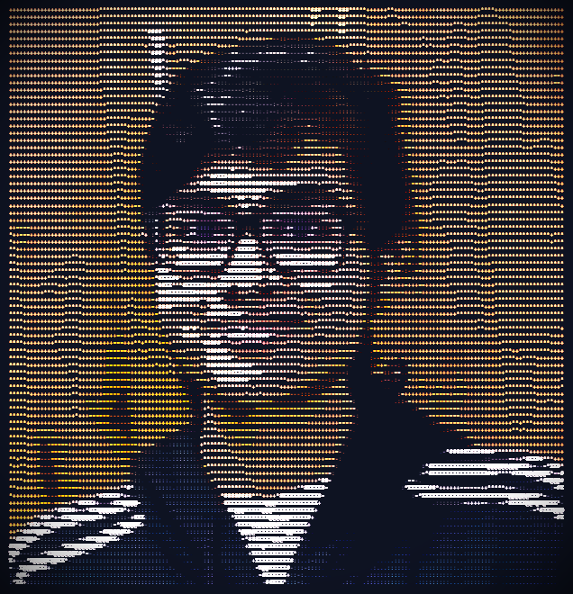

```
┌──────────────────────────────────────────────────────────────────────────────┐
│                              ░▒▓█ GOWRI ARUN █▓▒░                           │
│                        Applied AI & Full-Stack Developer                     │
└──────────────────────────────────────────────────────────────────────────────┘
```

<table>
  <tr>
    <td rowspan="2"></td>
    <td width="100%"><h1>Hey, I'm <a href="https://github.com/Gowri-Arun">Gowri Arun</a> 🩵</h1></td>
  </tr>
  <tr>
    <td><code>Applied AI & Full-Stack Developer</code> — building practical AI systems, research-oriented ML workflows, and full-stack products.</td>
  </tr>
</table>

```
┌─[ gowri@github ]─────────────────────────────────────────────────────────────┐
│                                                                              │
│  STATUS REPORT                                                               │
│                                                                              │
│  CURRENT PROJECTS                                                            │
│                                                                              │
│  Veridian AI     ████████████████████████████████░░░░░░░░░░░░░░░░  65%       │
│  ST-HF VVI-ReID  ████████████████████████████████████████████░░░░  85%       │
│  ToN-IoT IDS     ████████████████████████████████████████████████  95%       │
│                                                                              │
│  RECOGNITION                                                                 │
│                                                                              │
│  Girlathon 2025              First Runner-Up  ─  Vanta AI                   │
│  Bharatiya Antariksh Hack    Selected Team    ─  Astra-Q                    │
│                                                                              │
│  DAILY DRIVERS                                                              │
│                                                                              │
│  AI/ML    : PyTorch  TensorFlow  scikit-learn  LangChain  FAISS             │
│  Backend  : Python   FastAPI     Node.js        DuckDB     Neo4j            │
│  Frontend : React    TypeScript  Streamlit      Vite                        │
│  Ops      : Docker   Git         Makefile       pytest                      │
│                                                                              │
└──────────────────────────────────────────────────────────────────────────────┘
```

<p align="center">
  
  
</p>

<p align="center">
  
</p>

---

<p align="center">
  <b>⚡ PROJECTS ⚡</b>
</p>

| Project | Description | Stack |
|:---|---|---|
| [**Veridian AI**](https://github.com/Gowri-Arun/veridianAI_v2) | Enterprise query engine — ambiguous questions → grounded analytical answers | Python, FastAPI, DuckDB, RAG |
| [**ToN-IoT IDS**](https://github.com/Gowri-Arun/ToN-IoT-rareclass-IDS) | Rare-class MITM attack detection on IoT networks | LightGBM, KMeansSMOTE, XGBoost |
| [**Astra-Q**](https://github.com/Gowri-Arun/Astra_Q_Backend_fork) | KG + RAG help bot for ISRO's MOSDAC | Neo4j, LangChain, FAISS, Gemini |
| [**ST-HF VVI-ReID**](https://github.com/Gowri-Arun/ST-HF-VVI-ReID) | Video visible-infrared person re-identification | PyTorch, ResNet-50 |
| [**Vanta AI**](https://github.com/AnitaGeorge404/VantaAI) | Deepfake detection platform · Girlathon 2025 Runner-Up | React, Node.js, FastAPI |

---

<p align="center">
  <b>🧰 TECH STACK 🧰</b>
</p>

<p align="center">
  <br/>
  
</p>

---

<p align="center">
  <b>🌐 CONNECT 🌐</b>
</p>

<p align="center">
  <a href="https://gowri-arun-portfolio.vercel.app/"></a>
  <a href="https://www.linkedin.com/in/gowri-arun-/"></a>
  <a href="mailto:gowriarun2006@gmail.com"></a>
</p>

<p align="center">
  
</p>